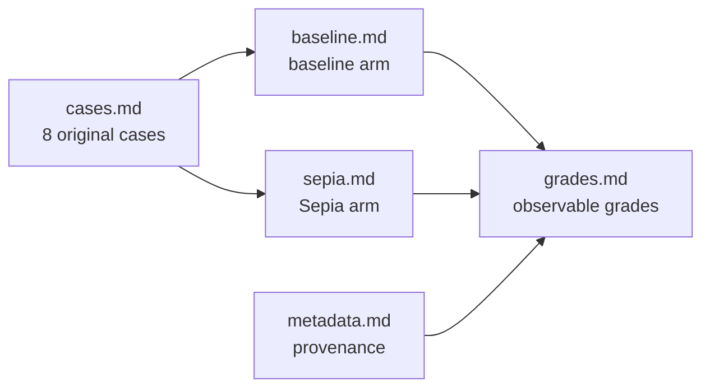

# PF3-EVAL-V1

This is a bounded, provenance-recorded evaluation pack for one run over eight
original cases. The same `cases.md` inputs feed two separately generated arms:
a baseline executor and a Sepia executor. The pack records observable
operation, route, and fact-preservation results for that run only.

## Scope and claims

The authoritative pack is exactly seven files: this README, `cases.md`,
`check.sh`, one run `metadata.md`, and the `baseline.md`, `sepia.md`, and
`grades.md` arm artifacts under that run. There are no YAML fixtures or other
input files.

| In scope | Meaning |
|---|---|
| Eight original cases | Four fiction routes and four professional-prose routes, each with an operation request and protected facts or voice. |
| Two arms | Baseline and Sepia are generated by independent fresh `executor` agents from the same cases. They do not read or edit the other arm; this proves cross-arm isolation only. |
| Observable grades | `PASS`, `FAIL`, or `NOT_RUN` records visible evidence for the requested operation, route, and fact-preservation invariants. |
| Bounded result | Statements describe this run at parent revision `b5a70677e8cd2ef6eaff828d12ad5ade9eaedc68`; they do not establish behavior outside this pack. |

This pack does not support human preference, human-likeness, statistical
efficacy, detector accuracy, skill effect, causality, or generalization.
Human-only questions are retained in the cases for later editorial review and
are `NOT_RUN` here. No external spend is part of the run.

## Sequence and isolation



The run starts by freezing the original inputs and recording provenance in
`runs/2026-08-30/metadata.md`. Each arm then receives only its assigned
operation prompt and the corresponding case input. Grading reads both arm
artifacts against the invariant rows in `cases.md`; it does not merge arm
outputs or let one arm supply missing evidence for the other.

The baseline name is an artifact label, not a no-Sepia control. Both agents ran
in a host where the repository exposed `.agents/skills/sepia` as a discovery
alias. The baseline instructions prohibited direct reads of that alias and the
canonical skill path, but host-level skill capability isolation is not proven.

## Grade semantics

`grades.md` has one row per case. After the case ID, its baseline columns are
operation, route, fact preservation, and four invariant statuses; the Sepia
columns repeat the same seven statuses. The final column is for human-only
questions. Every status cell uses the following meanings.

| Status | Meaning |
|---|---|
| `PASS` | The arm contains visible evidence satisfying that observable invariant. |
| `FAIL` | The arm contains visible evidence that omits or contradicts that invariant. |
| `NOT_RUN` | The invariant was not exercised or is human-only; it is not a pass or fail claim. |

The final human-only column must remain `NOT_RUN`. A `FAIL` is not a quality
score, and a `PASS` is not evidence of efficacy. The metadata records the
grader as not yet assigned until the arm outputs exist.

## Runner, gates, and rollback

The native runner is not used: local `claude plugin eval init --bare` on Claude
2.1.251 returned early-access exit 1. `check.sh` is therefore a Bash 3.2 and
standard-command contract check; `check.sh --self-test` copies the completed
pack to a temporary directory and proves deterministic failures for a missing
arm, missing case ID, wrong case heading level, missing routes, missing
metadata, human questions not marked `NOT_RUN`, an invalid status, an extra
grade row, and an extra arm section. It also rejects self-test startup when the
source pack is already invalid.

Run the checker from the repository root after all seven files are present:

```bash
bash evals/check.sh
bash evals/check.sh --self-test
```

Gate 5 is the exact repository-link and standalone-skill-link check:

```bash
ruby -e 'files=Dir.glob("**/*.md", File::FNM_DOTMATCH); bad=[]; files.each{|f| File.read(f).scan(/\[[^\]]*\]\(([^)]+)\)/).flatten.each{|u| next if u =~ %r{\A(?:https?://|#)}; p=u.split("#",2).first; next if p.empty?; bad << [f,u] unless File.exist?(File.expand_path(p,File.dirname(f)))}}; abort bad.inspect unless bad.empty?; puts "repo local links: PASS"'
task_tmp=$(mktemp -d)
cp -R skills/sepia "$task_tmp/sepia"
ruby -e 'root=ARGV[0]; bad=[]; Dir.glob(File.join(root,"**/*.md")).each{|f| File.read(f).scan(/\[[^\]]*\]\(([^)]+)\)/).flatten.each{|u| next if u =~ %r{\A(?:https?://|#)}; p=u.split("#",2).first; bad << [f,u] unless File.exist?(File.expand_path(p,File.dirname(f)))}}; abort bad.inspect unless bad.empty?; puts "standalone skill links: PASS"' "$task_tmp/sepia"
```

Before a PR, an incomplete pack must not be committed or opened as a PR;
leave the branch and worktree evidence for the main session. After an
unmerged PR, close the PR and retain the branch, or add an explicit removal
commit. The PF-2 parent revision `b5a70677e8cd2ef6eaff828d12ad5ade9eaedc68`
remains unchanged. Incomplete artifacts are never presented as accepted.
